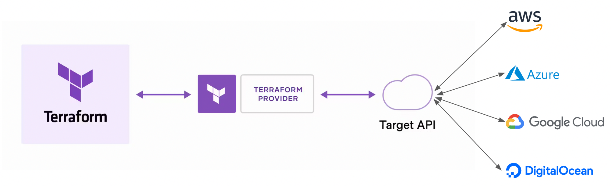

# Overview

## What is **Terraform**?

- An <ins>**infrastructure as code tool**</ins>: **Write** -> **Plan** -> **Apply**
- Lets you define both **cloud and on-prem resources** in **human-readable configuration files** that you can **version**, **reuse**, and **share**.

> NOTE#1: The markup language used by Terraform code is called as <ins>**HCL (HashiCorp Configuration Language)**</ins>.
> 
> NOTE#2: **Hashicorp** is the company that makes Terraform.

---

## How does **Terraform** work?

- Terraform creates and manages *resources* on **cloud platforms and other services** through <ins>**their application programming interfaces (APIs)**</ins>.
- <ins>**Providers**</ins> enable Terraform to work with virtually any platform or service with <ins>**an accessible API**</ins>.

    

---

## How do you work with Terraform?

:x: <ins>**NO**</ins> need to tell Terraform <ins>**HOW**</ins> to do what we want **imperatively**.

:white_check_mark: Instead, tell Terraform <ins>WHAT</ins> we want **declaratively**.

For example, in a Terraform project, you have defined that you want <ins>**4 AWS EC2 instances**</ins>.

- If **currently = 0 instance** -> After run Terraform-> Terraform will **create 4 new instances**.
- If **currently = 3 instances** -> After run Terraform-> Terraform will **create a new one instance**.
- If **currently = 5 instances** -> After run Terraform-> Terraform will **delete one instance**.

From the above example, Terraform will work with you by: 

- You <ins>**write**</ins> the configuration in the Terraform project to define the number of resources you want.
- Terraform <ins>**plans**</ins> for how to get from what you have to what you want based on the configuration file you write.
- Terraform <ins>**applies**</ins> the planned operations in the correct order, respecting any resource dependencies to make it happen.

